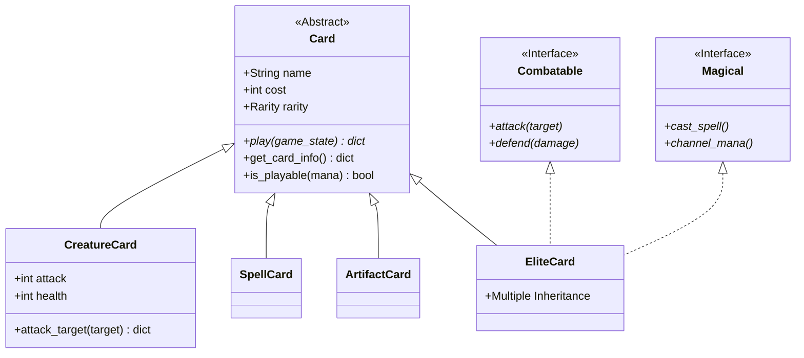

# 🃏 DataDeck: Architecture de Cartes Abstraites (Module 07)

Bienvenue dans la documentation exhaustive de **DataDeck**. Ce document n'est pas seulement un guide, c'est une autopsie technique de l'architecture logicielle mise en place pour ce module. Nous allons explorer chaque fichier, chaque méthode, et les choix de conception qui font de ce projet une référence en POO Python.

---

## 🏛️ Vue d'Ensemble de l'Architecture

Le projet suit une progression pédagogique allant de l'abstraction pure (Exercice 0) à l'intégration de patterns complexes comme la **Factory** et la **Strategy** (Exercice 3), pour finir par un système de gestion de tournoi (Exercice 4).

### � Diagramme de Classes (Simplifié)



---

## 📂 Analyse Fichier par Fichier

### 🔵 Exercice 0 : Les Fondations

#### `ex0/Card.py`
Ce fichier définit le contrat de base pour toutes les cartes.
- **`Rarity(Enum)`** : Définit les types `COMMON`, `UNCOMMON`, `RARE`, `EPIC`, `LEGENDARY`. L'héritage de `str` permet une sérialisation facile.
- **`Card(ABC)`** :
    - `__init__` : Initialise `self.name`, `self.cost`, `self.rarity` et `self.type`.
    - `play(self, game_state: dict[str, Any]) -> dict[str, Any]` : Déclarée `@abstractmethod`. Elle **doit** être implémentée par les enfants. Elle prend l'état du jeu et retourne le résultat de l'action.
    - `get_card_info()` : Retourne un dictionnaire. C'est ici que l'on voit l'importance du `type` pour permettre au front-end (ou au moteur) de savoir comment afficher la carte.
    - `is_playable(mana)` : Une simple comparaison booléenne.

#### `ex0/CreatureCard.py`
Hérite de `Card`. Ajoute la notion de combat physique.
- **Logic de Santé** : Le constructeur vérifie que `attack` et `health` ne sont pas négatifs. C'est une protection (Invariants).
- **`attack_target(self, target: "CreatureCard")`** : Compare `self.attack` à `target.health`. Retourne un rapport de combat détaillé.

---

### 🟢 Exercice 1 : Diversification et Collection

#### `ex1/SpellCard.py`
- **`effect_type`** : Permet de catégoriser le sort (dégâts, soin, buff).
- **`resolve_effect(targets)`** : Prend une liste d'objets `Card` et simule l'application de l'effet.

#### `ex1/ArtifactCard.py`
- **`durability`** : Un compteur d'utilisation.
- **`activate_ability()`** : Simule l'utilisation d'un passif ou d'un actif.

#### `ex1/Deck.py`
La gestion de la pile de cartes.
- **`add_card(card)`** : Utilise le type `Card` pour accepter n'importe quel sous-type (Polymorphisme).
- **`draw_card()`** : Retire la carte du haut du deck. Gère l'erreur `IndexError` via une vérification de longueur.
- **`get_deck_stats()`** : Utilise des *List Comprehensions* pour filtrer par type et calculer le coût moyen.

---

### 🟡 Exercice 2 : Interfaces et Héritage Multiple

C'est ici que nous séparons les **comportements** des **données**.

- **Interfaces (`Combatable` / `Magical`)** : Ce sont des classes purement abstraites (Interfaces). Elles définissent un comportement. `EliteCard` doit implémenter 6 méthodes supplémentaires en plus de `play()`.
- **`EliteCard.py`** : 
    - Gère l'initialisation de 9 paramètres.
    - Utilise `getattr()` et `hasattr()` dans les versions avancées pour manipuler dynamiquement les stats.
    - **Le défi technique** : Résoudre les collisions d'attributs et s'assurer que MyPy comprenne que `self.attack_power` appartient bien à la classe malgré l'héritage complexe.

---

### 🔴 Exercice 3 : Patterns Architecturaux (Factory & Strategy)

#### Card Factory Pattern
- **`CardFactory`** (Interface) et **`FantasyCardFactory`** (Concrète).
- **Pourquoi ?** Pour découpler le code client (le moteur de jeu) de la création des objets. Si demain on veut ajouter une `CyberpunkFactory`, le `GameEngine` n'aura pas besoin d'être modifié.
- **Logic** : La factory possède des catalogues (dictionnaires) et instancie les bonnes classes (`CreatureCard`, etc.) sur demande.

#### Strategy Pattern
- **`GameStrategy`** définit comment un tour doit se dérouler.
- **`AggressiveStrategy`** : Une logique codée en dur qui trie les cibles par priorité (`Enemy Player` avant tout).
- **Avantage** : On peut changer l'IA du bot en plein milieu d'une partie simplement en changeant l'objet `strategy` dans l'engine.

---

### 🟣 Exercice 4 : Tournament Platform

#### `TournamentCard.py`
Une carte "augmentée" qui possède un état persistant à travers les matchs (`wins`, `losses`, `rating`).

#### `TournamentPlatform.py`
- **`register_card`** : Génère un ID unique (`nom_001`).
- **`create_match`** : Simule un combat. La logique de victoire ici est simplifiée : somme de (Attaque + Défense). Cela démontre comment un système de règles peut être encapsulé.
- **`get_leaderboard`** : Trie les cartes par leur `rating` calculé dynamiquement.

---

## 🔬 Deep Dive : Notions Avancées

### 1. MRO (Method Resolution Order)
Dans l'exercice 2, avec `EliteCard(Card, Combatable, Magical)`, Python utilise l'algorithme C3 pour déterminer dans quel ordre chercher les méthodes. C'est crucial pour le `super().__init__()`.

### 2. Composition vs Héritage
Bien que le module utilise beaucoup l'héritage, le `GameEngine` utilise la **composition**. Il "possède" une factory et une stratégie. C'est le principe du *"Favor composition over inheritance"* (Favoriser la composition sur l'héritage).

### 3. Duck Typing vs Strong Typing
Grâce à `mypy --strict`, nous avons forcé Python (langage dynamique) à se comporter comme un langage statique. Cela évite 90% des bugs de "runtime" (erreurs à l'exécution) liés à des types inattendus.

---

## �️ Commandes Utiles


**Audit de Qualité :**
```bash
# Vérifie le style PEP 8 sans pitié
flake8 Module_07

# Vérifie que chaque variable est typée au millimètre près
mypy --strict Module_07
```

---

*Documentation générée avec précision pour les bâtisseurs d'architectures robustes.*

---

<div align="center">
  
</div>
